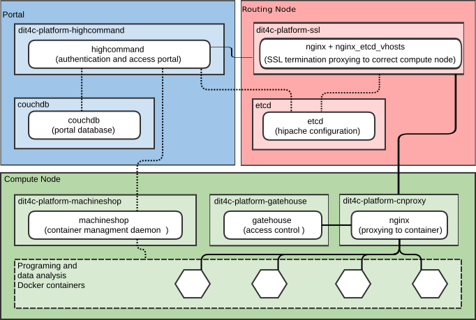

# DIT4C - Data Intensive Tools for the Cloud

[](https://gitter.im/dit4c/dit4c?utm_source=badge&utm_medium=badge&utm_campaign=pr-badge&utm_content=badge)

DIT4C is a scalable platform for providing containerized web-based programming and data analysis environments to researchers.

 * Client == Modern web browser
 * No local credentials: use your [GitHub][github] or [AAF][aaf] account
 * Based on Docker - runs on bare metal or cloud computing

All authentication is via federated identity providers - all a user needs is a modern web browser.

Current environments available are:
 * [Base][dit4c-container-base] - web-based TTY sessions and basic file management
 * [IPython Notebook + Base][dit4c-container-ipython]
 * [RStudio + Base][dit4c-container-rstudio]
 * [IJulia + Base][dit4c-container-ijulia]
 * [X11][dit4c-container-x11] - Base + X11 sessions via HTML5 VNC client
 * [Octave + X11][dit4c-container-octave]

## Motivation

The primary focus of DIT4C is [Software Carpentry Bootcamps][swc]. Having a working install right from the beginning means participants start programming sooner, and do so in a consistent environment.


## Architecture

DIT4C separates the portal environment which manages user access and containers from the compute nodes that provide them. In production environments, the components are designed to be deployed inside [Docker][docker] containers.



### Components

 * __highcommand__ - user authentication and container management portal.
 * __gatehouse__ - authorization checker for containers.
 * __machineshop__ - high-level API server for container management.

### Security

All container web traffic needs to authenticated and authorized by _gatehouse_. To avoid network lag, _gatehouse_ doesn't communicate directly with _highcommand_. Instead, it _highcommand_ signs a cookie which lists the containers the user is allowed to access. When the user accesses the container, that cookie is verified by _gatehouse_ and if the container is on the allowed list the traffic is authorized. For added security _highcommand_ rotates its keys regularly, so _gatehouse_ regularly fetches the valid key list (`/public-keys`) from _highcommand_.

Similarly, _machineshop_ also fetches _highcommand_ keys, and uses them to authenticate privileged requests following the [HTTP Signatures spec][http-signatures].

## Installing

To install DIT4C, you will need:

 * a domain name with DNS that allows you to create wildcard entries.
 * a SSL certificate for the domain and its wildcard. eg. `my.domain.example.test` & `*.my.domain.example.test`
 * at least one Linux host with Docker installed. ([CoreOS][coreos] is ideal.)
 * for authentication, at least one of:
   * a [RapidAAF account][rapidaaf] account or
   * a [GitHub][github-auth] application.

DIT4C has two Docker containers used to bootstrap new environments:
 * [dit4c-deploy-portal][dit4c-deploy-portal]
 * [dit4c-deploy-compute][dit4c-deploy-compute]

To deploy a portal:
 * Put your certificate and private key (`server.crt` & `server.key`) in `/opt/ssl`.
 * Put your DIT4C portal configuration (`dit4c-highcommand.conf`) in `/opt/config`.

```
application.baseUrl: "https://<your_domain_here>/"
application.secret: "<your_really_super_secret_cookie_signing_key_here>"

rapidaaf: {
  url: "<your_rapidaaf_redirect_url_here>",
  key: "<your_rapidaaf_secret_key_here>"
}

github: {
  id: "<your_github_application_id_here>",
  secret: "<your_github_application_secret_here>"
}
```

Once those files are in place, to deploy a portal, run:

```shell
# Change DIT4C_DOMAIN to your domain name
docker run --name dit4c_deploy_portal --rm \
           -e DIT4C_DOMAIN=my.domain.example.test
           -v /var/run/docker.sock:/var/run/docker.sock \
           dit4c/dit4c-deploy-portal
```

To deploy a compute node (preferably on another host), run:

```shell
# Change PORTAL_URL to reflect your domain name
docker run --name dit4c_deploy_compute --rm \
           -e PORTAL_URL=https://my.domain.example.test
           -v /var/run/docker.sock:/var/run/docker.sock \
           dit4c/dit4c-deploy-compute
```


[swc]: http://software-carpentry.org/
[aaf]: https://aaf.edu.au/
[rapidaaf]: https://rapid.aaf.edu.au/
[github]: https://github.com/
[github-auth]: https://developer.github.com/guides/basics-of-authentication/#registering-your-app
[docker]: https://www.docker.com/
[coreos]: https://coreos.com/
[http-signatures]: https://web-payments.org/specs/source/http-signatures/
[dit4c-container-base]: https://registry.hub.docker.com/u/dit4c/dit4c-container-base/
[dit4c-container-ipython]: https://registry.hub.docker.com/u/dit4c/dit4c-container-ipython/
[dit4c-container-rstudio]: https://registry.hub.docker.com/u/dit4c/dit4c-container-rstudio/
[dit4c-container-ijulia]: https://registry.hub.docker.com/u/dit4c/dit4c-container-ijulia/
[dit4c-container-x11]: https://registry.hub.docker.com/u/dit4c/dit4c-container-x11/
[dit4c-container-octave]: https://registry.hub.docker.com/u/dit4c/dit4c-container-octave/
[dit4c-deploy-portal]: https://registry.hub.docker.com/u/dit4c/dit4c-deploy-portal/
[dit4c-deploy-compute]: https://registry.hub.docker.com/u/dit4c/dit4c-deploy-compute/
